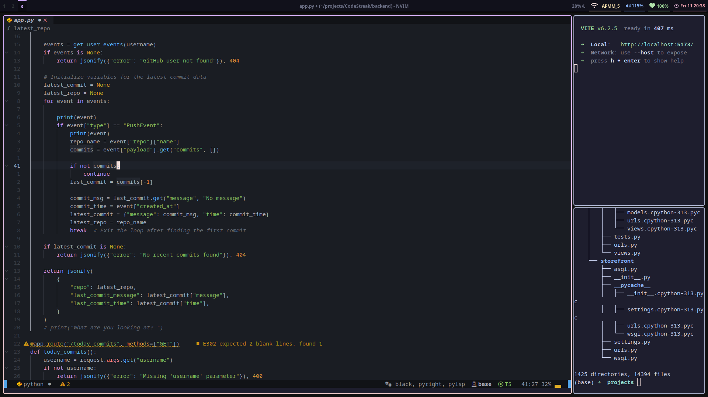

# Hyprland Configuration for Ubuntu

Welcome to my custom **Hyprland** configuration for Ubuntu! This setup is designed for performance, aesthetics, and productivity.

## install all the AUR and pacman packages

```bash
sudo pacman -S --needed - < pkglist.txt
yay -S --needed - < aurlist.txt

```

## Screen shot



## 🚀 Components

This configuration includes:

- **Alacritty** → A fast, GPU-accelerated terminal emulator.
- **Hyprland** → A dynamic tiling Wayland compositor.
- **Neovim (nvim)** → A highly configurable, efficient text editor.
- **Waybar** → A sleek and customizable status bar.
- **Wofi** → A minimalist application launcher.

---

## 📂 File Structure (Example)

```
~/.config/
├── alacritty/
│   └── alacritty.yml
├── hypr/
│   └── hyprland.conf
├── nvim/
│   └── init.vim
├── waybar/
│   ├── config
│   └── style.css
├── wofi/
│   └── config
└── README.md
```

Each directory contains the relevant configuration files for its respective component.

---

## ⚙️ Setup Instructions

### 1️⃣ Install Required Packages

Ensure you have the necessary packages installed:

```bash
sudo apt update && sudo apt install alacritty hyprland neovim waybar wofi git xdg-desktop-portal-hyprland
```

### 2️⃣ Clone the Configurations

```bash
git clone https://github.com/your-repo/hyprland-config.git ~/.config/
```

### 3️⃣ Symlink the Configurations

```bash
ln -s ~/.config/hyprland-config/alacritty ~/.config/alacritty
ln -s ~/.config/hyprland-config/hypr ~/.config/hypr
ln -s ~/.config/hyprland-config/nvim ~/.config/nvim
ln -s ~/.config/hyprland-config/waybar ~/.config/waybar
ln -s ~/.config/hyprland-config/wofi ~/.config/wofi
```

### 4️⃣ Start Hyprland

To start Hyprland, log out and select Hyprland as your session in the login manager, or run:

```bash
Hyprland
```

---

## 🎨 Customization

### 🌟 Themes & Appearance

Modify **Waybar** styles:

```css
~/.config/waybar/style.css
```

Customize **Alacritty** colors:

```yaml
~/.config/alacritty/alacritty.yml
```

Adjust **Hyprland** animations and layouts:

```conf
~/.config/hypr/hyprland.conf
```

### ⌨️ Keybindings

- **Terminal** → `Super + Return` (Opens Alacritty)
- **Exit** → `Super + M`
- **Launcher** → `Super + D` (Opens Wofi)
- **Close Window** → `Super + Q`
- **Move Focus** → `Super + Arrow Keys`
- **Switch Workspaces** → `Super + 1-9`

---

## 📜 Notes

- This setup is optimized for **Wayland** and may not work in X11.
- Ensure `xdg-desktop-portal-hyprland` is installed for better app support:
  ```bash
  sudo apt install xdg-desktop-portal-hyprland
  ```
- Adjust configurations according to your hardware and preferences.

Enjoy your **Hyprland** experience on Ubuntu! 🚀
